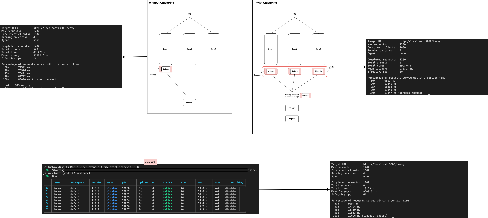

# Clustering in Node.js

## overview

This repository demonstrates how to implement clustering in Node.js to enhance application performance. Clustering is a technique that involves running multiple Node.js processes concurrently to handle incoming requests. By distributing the workload across multiple processes, the application can take advantage of multi-core systems, resulting in improved scalability and performance.


## Getting Started

### Prerequisites
* Node.js installed on your machine 

### Installation

1. Clone this repository:

```bash
git clone https://github.com/seifmahmoud871/clustering-nodejs.git
```

```bash 
cd clustering-nodejs
```

2. Install dependencies:

```bash 
npm install
```


## Benefits of Clustering

* **Improved Performance:** Distributing the workload across multiple processes can lead to better utilization of system resources.

* **Scalability:** Clustering allows the application to scale horizontally by adding more worker processes.

* **Fault Tolerance:** If one worker process fails, others can continue to handle requests, enhancing the overall reliability of the application.


